# 学生成绩管理系统界面展示

# 1、界面展示
## 1.1 系统功能结构
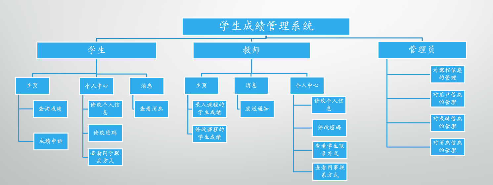
## 1.2 系统

|  登录 | 注册  | 修改密码 |
|---|---|---|
| 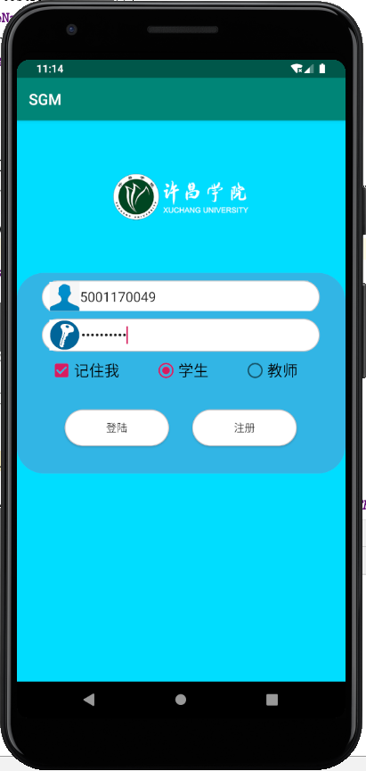  | 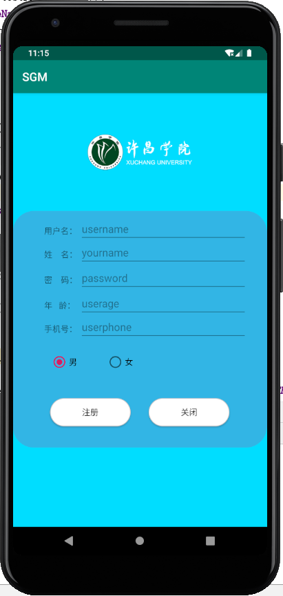  | 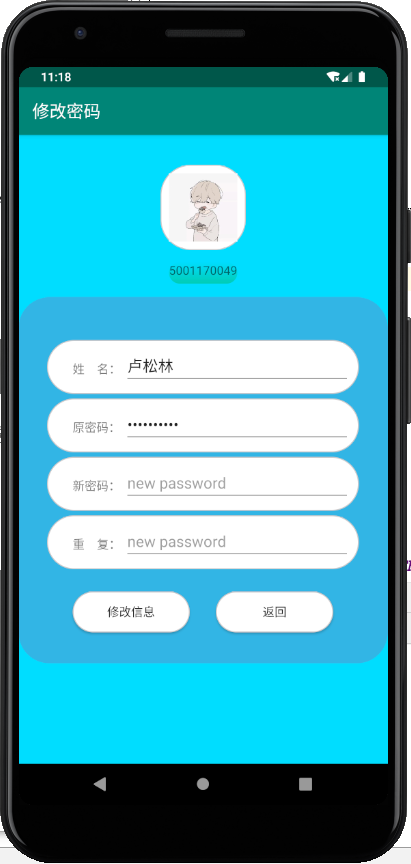   |
## 1.3 学生

|  主页 | 个人中心  |  我的消息   |
|---|---|---|
| 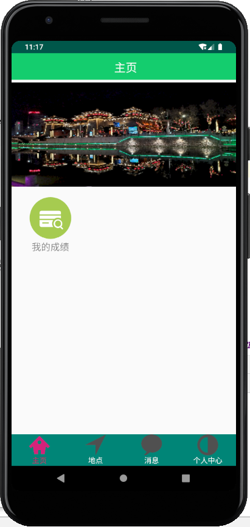  |  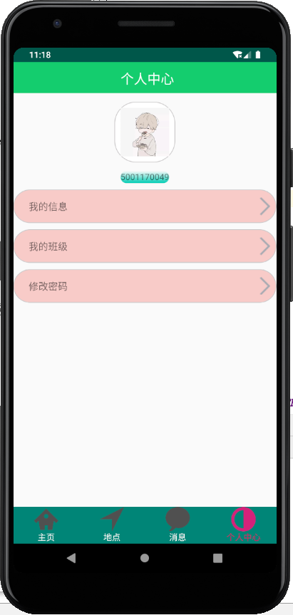 | 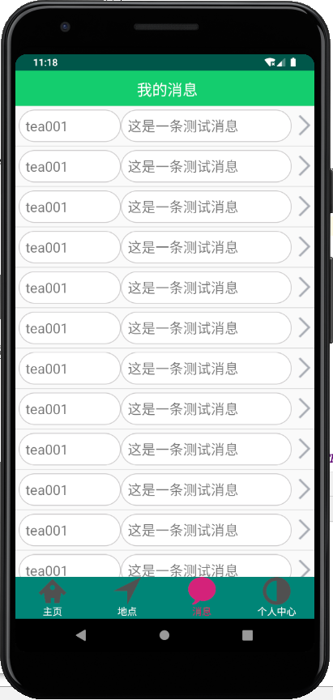|

|  我的班级 | 我的成绩  |  修改信息   | 确认消息|
|---|---|---|---|
| 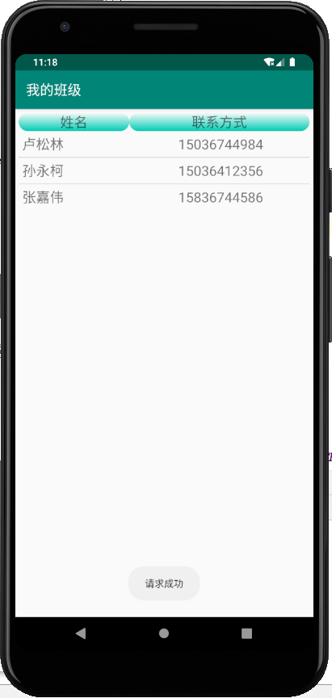 |  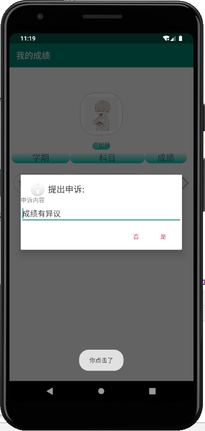 | 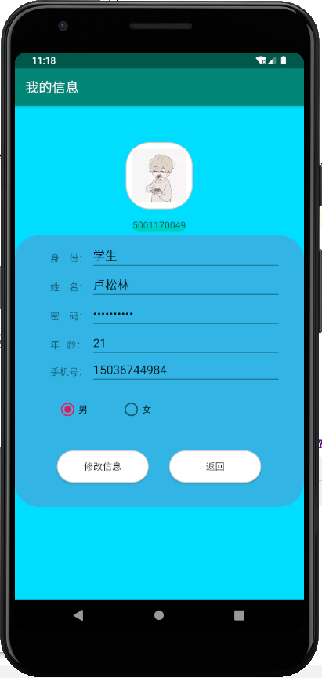| 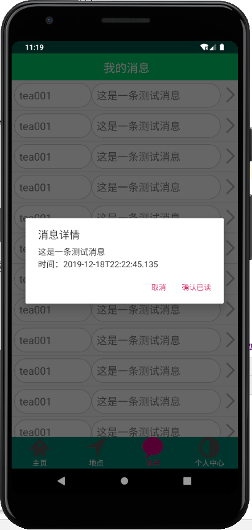|

## 1.3 教师

| 我的同事 | 添加成绩 |  发送消息   | 修改成绩 |
|---|---|---|---|
| 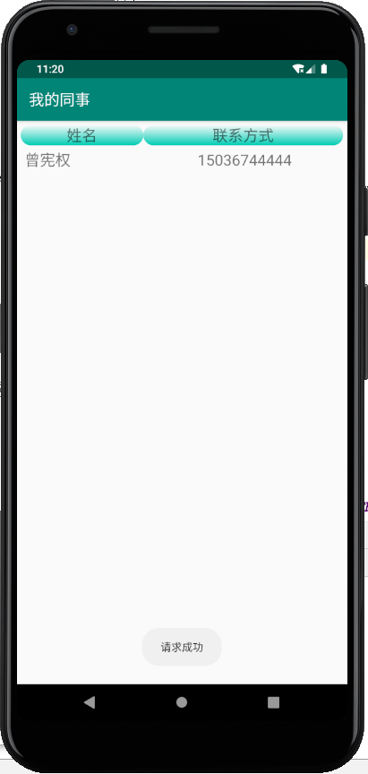 |  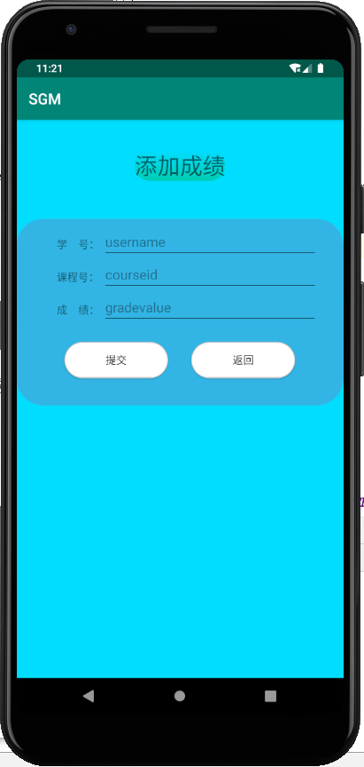 | 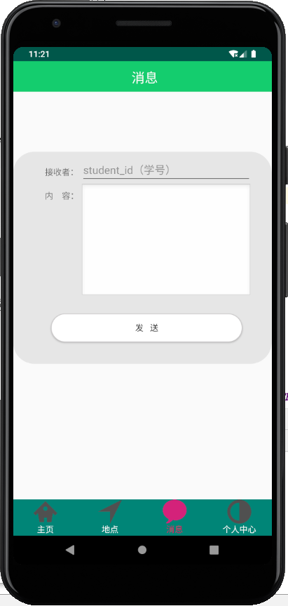| 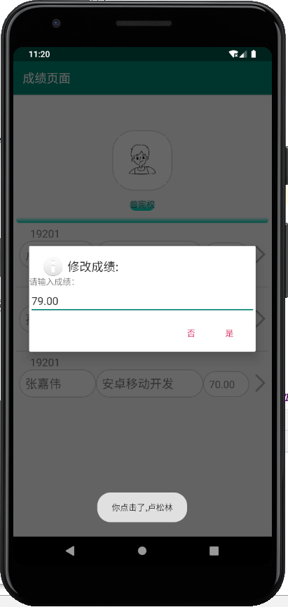|

> 注：其他功能参见学生界面！

# 2、演示视频

视频地址:[https://github.com/kleinlsl/XSGManage/blob/master/project-file/video/show-how.mp4](https://github.com/kleinlsl/XSGManage/blob/master/project-file/video/show-how.mp4)
<video width="800" >
    <source src="video/show-how.mp4" type="video/mp4"/>
</video>

